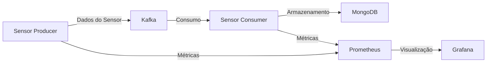

# Code Assignment - Monitoramento de Sensores IoT


Você precisa criar um sistema de monitoramento de sensores IoT que envia dados de sensores em tempo real para um tópico Kafka (producer) e consome esses dados para processamento e armazenamento (consumer).

---

## 1. Criar o Producer

- Desenvolver um script em Python (ou outra linguagem de sua escolha) que gera dados falsos de sensores IoT e envia esses dados para um tópico Kafka.  
- Utilizar uma biblioteca como `faker` para gerar dados falsos.

---

## 2. Criar o Consumer

- Desenvolver um script que consome os dados do tópico Kafka e processa esses dados.  
- Armazenar os dados consumidos em um banco de dados.

## Índice
- [Arquitetura](#arquitetura)
- [Pré-requisitos](#pré-requisitos)
- [Instalação](#instalação)
- [Uso](#uso)
- [Monitoramento](#monitoramento)
- [Testes](#testes)
- [Estrutura do Projeto](#estrutura-do-projeto)
- [Schemas](#api-e-schemas)

## Arquitetura



### Componentes
- **Producer**: Gera dados simulados de sensores de temperatura
- **Kafka**: Message broker para streaming de dados
- **Consumer**: Processa e valida os dados
- **MongoDB**: Armazenamento persistente
- **Prometheus**: Coleta de métricas
- **Grafana**: Visualização e monitoramento

## Pré-requisitos
- Docker
- Docker Compose

## Instalação

1. Clone o repositório:
```powershell
git clone <repository-url>
cd assignment-sensor-iot
```

2. Construa e inicie os containers:
```powershell
docker-compose up --build
```

## Uso

### Iniciando o Sistema
```powershell
docker-compose up --build
```

### Parando o Sistema
```powershell
docker-compose down
```

### Logs dos Serviços
```powershell
# Logs do producer
docker-compose logs sensor-producer

# Logs do consumer
docker-compose logs sensor-consumer
```

## Monitoramento

### Acessando os Dashboards
- **Grafana**: http://localhost:3000
  - Usuário: admin
  - Senha: admin
- **Prometheus**: http://localhost:9090

### Métricas Disponíveis

#### Producer
| Métrica | Descrição |
|---------|-----------|
| sensor_messages_produced_total | Total de mensagens produzidas |
| sensor_producer_failures_total | Total de falhas na produção |
| sensor_messages_produced_per_minute | Taxa de mensagens/minuto |

#### Consumer
| Métrica | Descrição |
|---------|-----------|
| sensor_messages_consumed_total | Total de mensagens consumidas |
| sensor_consumer_failures_total | Total de falhas no consumo |
| sensor_messages_consumed_per_minute | Taxa de mensagens/minuto |
| sensor_validation_failures_total | Falhas na validação de schema |

## Testes

### Executando Testes
```powershell
docker exec -it assignment-sensor-iot-sensor-consumer-1 pytest
```

## Estrutura do Projeto
```
.
├── consumer/           # Consumidor Kafka
├── producer/           # Produtor de dados
├── schemas/           # Definições de schema
├── writer/            # Interface com MongoDB
├── monitoring/        # Configurações de métricas
├── tests/            # Testes automatizados
└── grafana-provisioning/  # Dashboards e datasources
```

## Schemas

### Formato dos Dados do Sensor
```json
{
  "sensor_type": "temperature",
  "sensor_id": "uuid",
  "timestamp": "ISO-8601",
  "reading": {
    "value": "float",
    "unit": "C"
  },
  "location": {
    "latitude": "float",
    "longitude": "float"
  }
}
```

### Logs e Diagnóstico
```powershell
# Ver todos os logs
docker-compose logs

# Ver logs específicos
docker-compose logs sensor-producer
docker-compose logs sensor-consumer
```

## Configurações

### Variáveis de Ambiente
- `KAFKA_TOPIC`: Tópico Kafka (default: sensores)
- `KAFKA_BOOTSTRAP_SERVERS`: Endereço Kafka (default: kafka:9092)
- `MONGODB_URI`: URI MongoDB (default: mongodb://mongodb:27017)

### Retenção Kafka
- Período: 7 dias
- Tamanho máximo: 1GB

## Autor 
Rafael Passador
Code Elevate Assignment - 2025