# IoT Kafka MongoDB Pipeline

Sistema de streaming de dados IoT utilizando Apache Kafka, MongoDB, Prometheus e Grafana para ingestão, processamento e monitoramento de dados de sensores em tempo real.

## 📋 Índice
- [Arquitetura](#arquitetura)
- [Pré-requisitos](#pré-requisitos)
- [Instalação](#instalação)
- [Uso](#uso)
- [Monitoramento](#monitoramento)
- [Testes](#testes)
- [Estrutura do Projeto](#estrutura-do-projeto)
- [API e Schemas](#api-e-schemas)
- [Troubleshooting](#troubleshooting)

## 🏗 Arquitetura

```mermaid
graph LR
    A[Sensor Producer] -->|Dados do Sensor| B[Kafka]
    B -->|Consumo| C[Sensor Consumer]
    C -->|Armazenamento| D[MongoDB]
    A -->|Métricas| E[Prometheus]
    C -->|Métricas| E
    E -->|Visualização| F[Grafana]
```



### Componentes
- **Producer**: Gera dados simulados de sensores de temperatura
- **Kafka**: Message broker para streaming de dados
- **Consumer**: Processa e valida os dados
- **MongoDB**: Armazenamento persistente
- **Prometheus**: Coleta de métricas
- **Grafana**: Visualização e monitoramento

## 🛠 Pré-requisitos
- Docker
- Docker Compose
- 4GB RAM (mínimo)
- 10GB espaço em disco

## 📦 Instalação

1. Clone o repositório:
```powershell
git clone <repository-url>
cd assignment-sensor-iot
```

2. Construa e inicie os containers:
```powershell
docker-compose up --build
```

## 🚀 Uso

### Iniciando o Sistema
```powershell
docker-compose up --build
```

### Parando o Sistema
```powershell
docker-compose down
```

### Logs dos Serviços
```powershell
# Logs do producer
docker-compose logs sensor-producer

# Logs do consumer
docker-compose logs sensor-consumer
```

## 📊 Monitoramento

### Acessando os Dashboards
- **Grafana**: http://localhost:3000
  - Usuário: admin
  - Senha: admin
- **Prometheus**: http://localhost:9090

### Métricas Disponíveis

#### Producer
| Métrica | Descrição |
|---------|-----------|
| sensor_messages_produced_total | Total de mensagens produzidas |
| sensor_producer_failures_total | Total de falhas na produção |
| sensor_messages_produced_per_minute | Taxa de mensagens/minuto |

#### Consumer
| Métrica | Descrição |
|---------|-----------|
| sensor_messages_consumed_total | Total de mensagens consumidas |
| sensor_consumer_failures_total | Total de falhas no consumo |
| sensor_messages_consumed_per_minute | Taxa de mensagens/minuto |
| sensor_validation_failures_total | Falhas na validação de schema |

## 🧪 Testes

### Executando Testes
```powershell
docker exec -it assignment-sensor-iot-sensor-consumer-1 pytest
```

### Cobertura de Testes
- Testes de integração Kafka
- Testes do MongoDB writer
- Validação de schema
- Métricas e monitoramento

## 📁 Estrutura do Projeto
```
.
├── consumer/           # Consumidor Kafka
├── producer/           # Produtor de dados
├── schemas/           # Definições de schema
├── writer/            # Interface com MongoDB
├── monitoring/        # Configurações de métricas
├── tests/            # Testes automatizados
└── grafana-provisioning/  # Dashboards e datasources
```

## 📝 API e Schemas

### Formato dos Dados do Sensor
```json
{
  "sensor_type": "temperature",
  "sensor_id": "uuid",
  "timestamp": "ISO-8601",
  "reading": {
    "value": "float",
    "unit": "C"
  },
  "location": {
    "latitude": "float",
    "longitude": "float"
  }
}
```

## 🔧 Troubleshooting

### Problemas Comuns

1. **Kafka não inicia**
   ```powershell
   docker-compose restart kafka
   ```

2. **MongoDB não conecta**
   - Verifique as credenciais
   - Confirme a URI de conexão

3. **Métricas não aparecem**
   - Verifique portas: 8000 (producer) e 8001 (consumer)
   - Confirme acesso ao Prometheus (9090)

### Logs e Diagnóstico
```powershell
# Ver todos os logs
docker-compose logs

# Ver logs específicos
docker-compose logs sensor-producer
docker-compose logs sensor-consumer
```

## 🔐 Configurações

### Variáveis de Ambiente
- `KAFKA_TOPIC`: Tópico Kafka (default: sensores)
- `KAFKA_BOOTSTRAP_SERVERS`: Endereço Kafka (default: kafka:9092)
- `MONGODB_URI`: URI MongoDB (default: mongodb://mongodb:27017)

### Retenção Kafka
- Período: 7 dias
- Tamanho máximo: 1GB

## 📈 Métricas de Performance
- Taxa de processamento: ~60 mensagens/minuto
- Latência média: <100ms
- Uso de memória: ~256MB por serviço